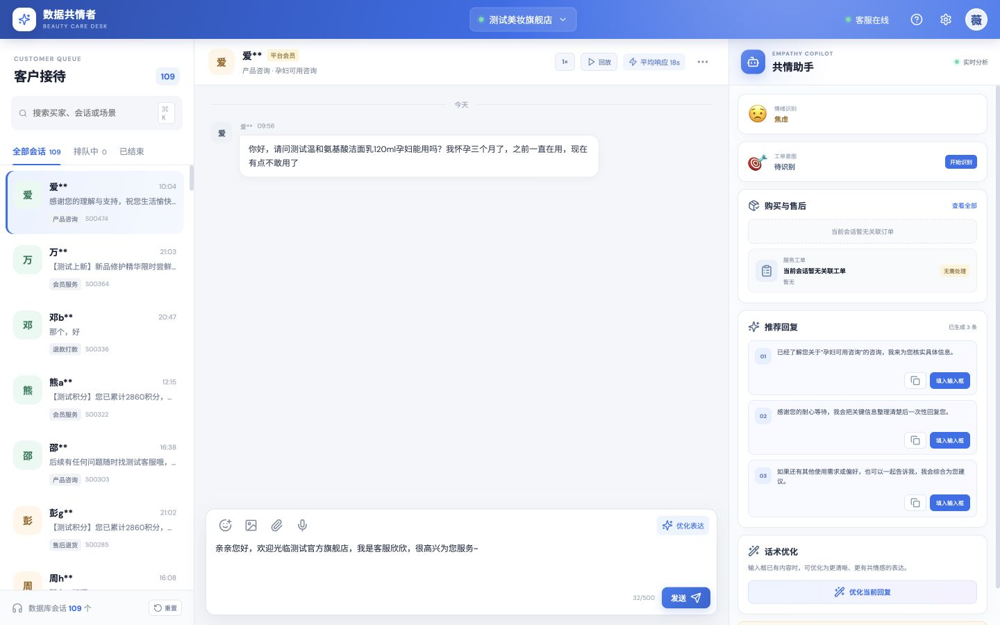
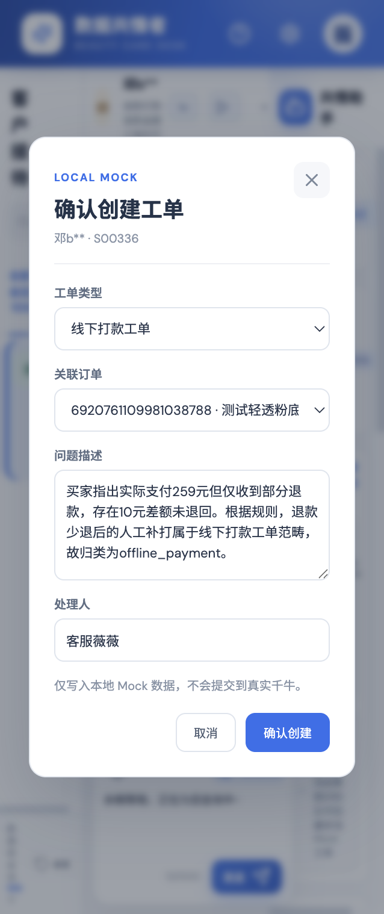
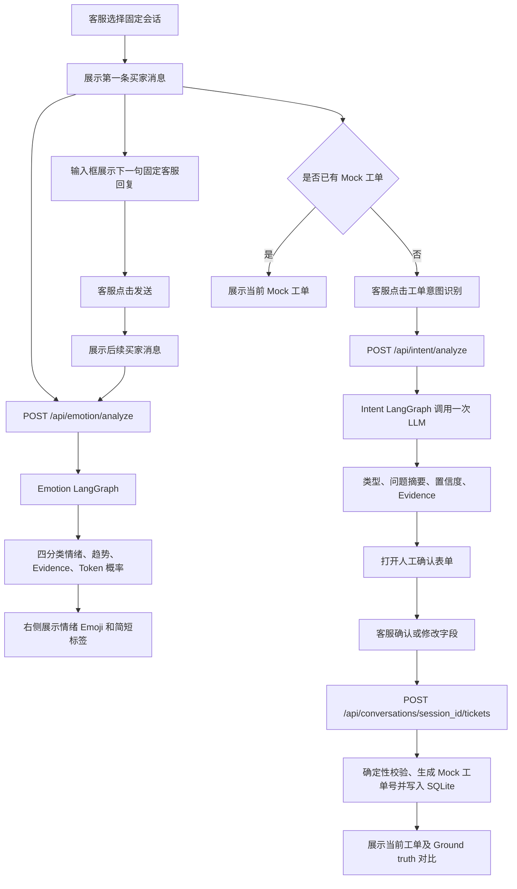
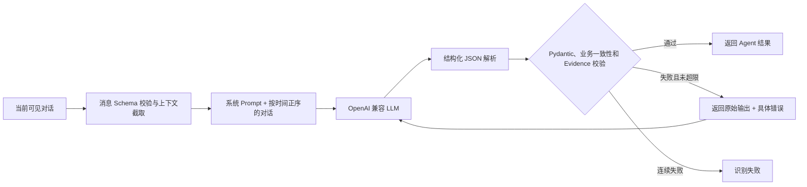
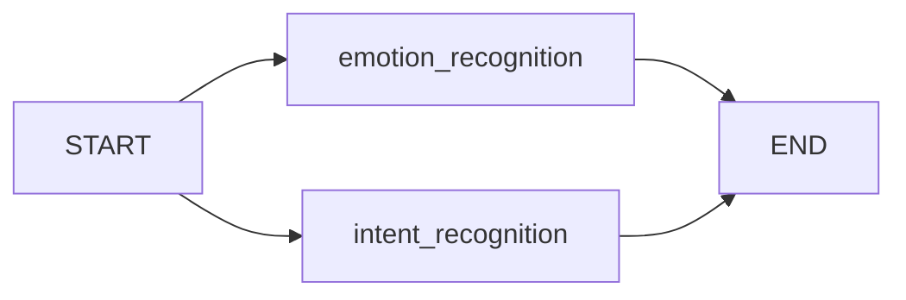
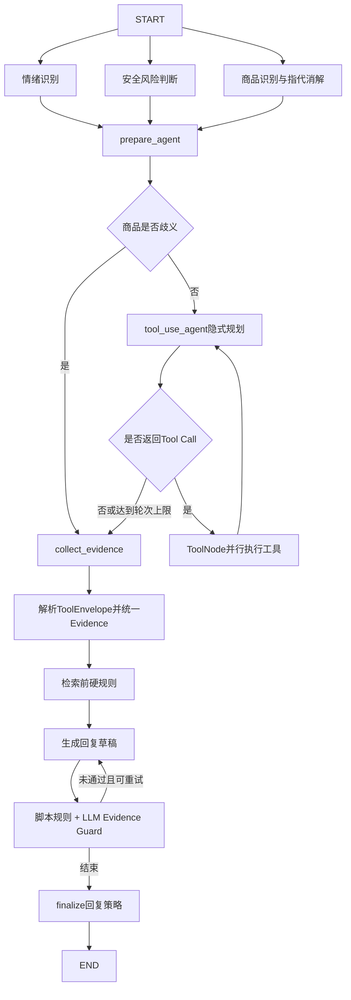

# 数据共情者｜美妆智能客服工作台

本项目面向美妆电商客服场景，基于比赛会话、订单和工单数据，构建一个可回放固定历史对话的智能客服工作台。系统当前已接入用户情绪识别 Agent 和点击触发的工单意图识别 Agent，并通过结构化输出、原文证据校验和带错误反馈的定向重试，提升识别结果的可审核性。

## 项目进度

| 模块 | 状态 | 说明 |
|---|---|---|
| Excel 数据导入 | ✅ 已完成 | 导入 SQLite，并按规则过滤包含图片的完整会话 |
| 固定会话回放 | ✅ 已完成 | 进入会话后从第一条买家消息开始，输入框只展示下一句固定客服回复 |
| 情绪识别 Agent | ✅ 已接入 | 四分类，在每个买家轮次后自动识别 |
| 情绪结果反馈 | ✅ 已接入 | 客服可纠正当前结果，后端保留对话快照与模型元数据 |
| 工单意图 Agent | ✅ 已接入 | 五分类，由客服点击“开始识别”后调用 |
| 订单与工单上下文 | ✅ 已完成 | 原始工单作为隐藏 Ground truth，Mock 建单后才展示当前工单 |
| 工单意图 Prompt 评测 | ✅ 已完成 | V1.3.1 在 80 条开发集会话的修订业务口径下为 80/80 |
| 推荐回复 | 🟡 本地规则 | 当前为按场景返回的固定可审核话术，未接入 LLM |
| 话术优化 | 🟡 本地规则 | 当前为前端可预测规则，未接入 LLM |
| 商品知识图谱 | ✅ 已构建 | 独立 Neo4j 5.26，当前 61 个节点和 82 条关系 |
| 商品 GraphRAG | ✅ 已构建 | Microsoft GraphRAG 2.1.0 索引、社区报告和 LanceDB 向量已生成 |
| 知识回复 Agent | ✅ 已接入 | `knowledge-v1.1.0`，单主Agent执行隐式工具规划，互不依赖的Neo4j / GraphRAG / 动态数据工具并行调用 |
| Langfuse Trace | ✅ 已接入 | 配置凭证后记录根Trace、LangGraph节点、模型、工具、安全检查、耗时和错误；当前一次咨询约40～50个Observation |
| 本地 Mock 工单创建 | ✅ 已完成 | Agent 识别后由客服确认，写入独立仿真表并生成 Mock 工单号 |
| 真实千牛工单创建 | ⚪ 待实现 | 当前不会向千牛或其他业务系统写入新工单 |
| Knowledge Agent回归集 | 🟡 待业务确认 | 当前优先使用50条轻量Demo回归集；原150/50/100严格数据保留为历史构造版本 |

> 注意：V1.3.1 的 100% 是开发集结果，不能直接代表对新会话的真实泛化准确率。

## 前端页面



页面采用三栏工作台布局：

- **左侧客户接待区**：展示 109 个经过图片会话过滤的数据库会话，支持会话列表、买家脱敏信息、场景和最新消息展示。
- **中间会话区**：回放固定历史会话。进入会话时只显示第一条买家消息，输入框只读展示下一句客服原始回复，点击发送后继续显示下一轮买家消息。
- **右侧共情助手**：展示情绪识别、工单意图、订单、Mock 工单、评测结果、推荐回复和话术优化等辅助信息。

## 核心功能

### 1. 固定多轮会话仿真

- 使用比赛历史会话作为固定脚本。
- 不允许客服随意输入，输入框固定展示下一句客服原话。
- 每次发送客服回复后，会话推进到下一个客服回复前的所有买家消息。
- 支持会话回放速度切换和仿真消息重置。

### 2. 四分类情绪识别 Agent

当前 Prompt 版本：`emotion-v1.2.0`。

| 标签 | 中文含义 | 主要覆盖 |
|---|---|---|
| `neutral` | 中性/平稳 | 普通咨询、客观陈述、感谢、认可、明显缓和 |
| `anxious` | 焦虑 | 担心不良后果、时间紧迫、害怕、反复确认 |
| `dissatisfied` | 不满 | 失望、质疑、不信任、轻中度挫败 |
| `angry` | 愤怒 | 强烈责备、对抗、辱骂、威胁投诉或起诉 |

输出字段包括情绪标签、趋势、买家原文证据、可审核摘要、Prompt 版本和实际调用次数。置信度不由模型自报，而是根据情绪标签输出 Token 的 logprob 计算。

客服可在右侧情绪卡片点击“纠正”，选择正确情绪并填写选填备注。反馈通过 `POST /api/emotion/feedback` 写入独立的 `emotion_feedback` 表，同时保存当时可见的完整对话、原预测、置信度、证据、Prompt 版本和纠正时间。这些反馈不会直接修改线上 Prompt 或原始聊天记录，需审核后再用于评测和迭代。

### 3. 五分类工单意图 Agent

当前 Prompt 版本：`intent-v1.3.1`。

客服点击“开始识别”代表准备创建工单，因此不包含 `no_ticket`，`need_ticket` 始终为 `true`。

| 标签 | 工单类型 | 典型场景 |
|---|---|---|
| `reship_exchange` | 补发换货 | 赠品/小样漏发、错发色号、非运输原因的商品功能故障 |
| `offline_payment` | 线下打款 | 价保补差、少退补打、运费报销、无法原路退款 |
| `logistics_ticket` | 物流工单 | 物流停滞、签收未收到、运输破损、拦截改址、正装少发/漏发 |
| `adverse_reaction` | 不良反应 | 中重度使用不适、就医、不良反应专项记录或安全回访 |
| `after_sales_return` | 售后退货 | 拒收、退货退款、空包裹仅退款、轻微不适普通退货 |

输出包含工单类型、置信度、带角色的原文证据、可审核摘要、Prompt 版本和调用次数。导入的原始工单均创建于会话结束之后，因此只作为隐藏的 Ground truth，不会在回放开始时被当成已有工单。客服可在识别后确认或修改类型、关联订单、问题描述和处理人，再创建一张仅保存在本地的 Mock 工单；创建后页面才展示当前工单，并显示其类型与 Ground truth 是否一致。

页面左下角“重置”会同时清除仿真回复和 Mock 工单，便于重复演示；导入的原始业务数据和人工纠正反馈不会被删除。

#### 工单创建职责边界

工单创建流程只调用一次 LLM。LLM 负责理解当前可见对话并输出工单类型、问题摘要、置信度和原文 Evidence；关联订单、处理人、工单状态、Mock 工单号、防重复校验和 SQLite 写入均由确定性程序完成。客服必须在确认窗口中审核或修改预填字段后才能创建工单。



确认窗口会预填 Agent 识别出的工单类型和问题描述，并带入可关联的订单与默认处理人。客服可在提交前修改全部字段；点击“确认创建”后才会写入本地 Mock 工单表，不会向真实千牛提交。

```text
当前可见对话
  → LLM 识别工单类型并生成问题摘要
  → 前端预填类型、描述、订单和处理人
  → 客服人工确认或修改
  → 后端校验并写入 simulation_tickets
  → 返回 Mock 工单号
  → 与隐藏的原始 Ground truth 比较
```

客服修改工单类型时，问题描述不会再次调用 LLM 自动重写，仍需一并人工核对。情绪识别虽然也使用 LLM，但它是独立链路，不参与工单创建。

### 4. 结构化校验与定向重试

- LLM 通过 Pydantic Schema 输出固定 JSON 结构。
- 后端校验枚举、类型、字段一致性和 Evidence 是否真实存在于对应角色原话。
- 校验失败时，将模型原始输出和具体错误反馈给模型，进行定向修复。
- 当前默认最大 Schema 重试次数为 3；重试后仍失败，API 返回“识别失败”，前端展示失败状态。

### 5. 商品知识回复 Agent

当前 Knowledge Agent 是“单主Agent Tool-Use Loop”，不是多个SubAgent协作，也没有独立Planner节点。主Agent结合用户问题、商品上下文和安全决策，在一次模型输出中直接生成一个或多个Tool Call；LangGraph `ToolNode`并行执行互不依赖的工具，结果返回同一个主Agent，由其判断证据是否充足以及是否进入下一轮检索。

```text
单个 Knowledge Agent
  → 隐式工具规划
  → 同一轮生成多个 Tool Call
      ├─ query_product_graph
      ├─ search_product_documents
      └─ check_dynamic_data
  → ToolNode并行执行
  → 统一Evidence
  → 主Agent判断继续检索或结束
```

当前存在轻量的“问题拆分”：例如“黑金精华有哪些抗老成分，日常怎么用”可以被模型拆成Neo4j成分查询和GraphRAG使用说明查询。但拆分只表现为多个Tool Call，不会生成独立`plan`对象，不包含子任务ID、依赖关系、完成状态或SubAgent。

#### 意图理解与工具路由

当前没有独立的固定类别业务意图分类器。Tool-Use Agent直接理解问题并选择工具：

- Neo4j查询类型共7种：`auto`、`product_overview`、`skus`、`ingredients`、`faq`、`comparison`、`text2cypher`。
- 动态数据类型共7种：`price`、`stock`、`promotion`、`gift`、`logistics`、`order`、`after_sales`。
- 安全风险固定为`low`、`medium`、`high`三级，安全类别说明由模型生成，不是固定枚举。
- Neo4j FAQ数据中的10类`intent`只用于FAQ过滤和数据管理，不代表线上流程存在一个10分类模型。

#### Neo4j、GraphRAG与动态数据分工

| 工具 | 主要职责 | 数据特点 |
|---|---|---|
| `query_product_graph` | 商品、SKU、容量、成分、肤质、功效、FAQ和商品对比 | 结构化、确定性、支持预定义Cypher和受控Text2Cypher |
| `search_product_documents` | 商品说明、使用场景、版本差异、成分语义、安全边界和综合解释 | GraphRAG Markdown索引、实体关系、文本单元与社区报告 |
| `check_dynamic_data` | 价格、库存、优惠、赠品、物流、订单和售后资格 | 当前仅检查实时来源是否可用，尚未接入千牛真实接口 |

涉及结构化事实和解释性知识时，主Agent可以在同一轮同时调用Neo4j和GraphRAG。当前工具规划仍可能选错查询类型，例如2026-08-28实测中，“四代黑精华会不会很油”被规划为Neo4j `skus`查询；SKU结果对质地问题帮助有限，最终主要依赖GraphRAG证据。这是后续增加高频确定性路由的重要原因。

#### 统一工具返回结构

每个工具通过LangChain `ToolMessage`返回JSON字符串，解析后统一为：

```json
{
  "tool": "search_product_documents",
  "ok": true,
  "evidence": [
    {
      "evidence_id": "EV-...",
      "source_type": "graphrag",
      "source_id": "graphrag:local",
      "product_ids": ["LOREAL_GEN4_BLACK"],
      "fact_type": "graphrag_local",
      "content": "检索得到的证据内容",
      "risk_level": "low",
      "is_mock": true,
      "is_realtime": false,
      "metadata": {}
    }
  ],
  "error": null,
  "metadata": {}
}
```

工具结果按`tool_call_id`与原始Tool Call对应，去重后写入LangGraph State中的`evidence`、`tool_calls`和`tool_errors`。回复生成节点只能使用这些Evidence，不允许依赖模型自身知识补全商品事实。

#### 商品识别、安全与Evidence Guard

- 商品卡片ID优先；明确商品名使用别名规则，不调用LLM。
- 只有省略主体、上下文指代或“它、这款、前者、后者”等表达才调用受约束的商品指代模型。
- 情绪识别、安全判断和商品识别从`START`并行运行。
- Evidence Guard包含脚本硬规则和LLM语义审核；首次不通过最多重新生成一次。
- Neo4j查询在执行前经过只读Hook，拒绝写子句、多语句、`CALL`、越界Schema和过大`LIMIT`，并使用只读事务执行。
- 生产环境仍必须使用Neo4j独立只读账号作为最终权限兜底。

#### 回复策略与业务边界

Knowledge Agent只返回回复和策略，不会把消息发送到千牛：

| 策略 | 当前代码含义 |
|---|---|
| `auto_send` | 低风险且证据充分时返回的策略标记；当前项目不会实际发送 |
| `draft` | 中风险、动态数据不可用、商品对比、宽范围GraphRAG或存在未支持结论 |
| `escalate` | 高风险、商品歧义、缺少证据或Evidence Guard未通过 |

当前业务目标是所有Agent回复先作为客服草稿，不自动发送。因此现有`auto_send`不能直接接入千牛发送接口，后续需要统一收敛为`draft`或增加人工确认门。

## Agent 流程图

### 当前前端主流程



### Agent 内部识别与重试



### 保留的可选并行 Graph

`analysis_agent` 中保留了情绪识别和工单意图识别并行分支，对应 `/api/analysis/analyze` 接口。该 Graph 不是当前前端主流程：前端当前会自动调用情绪识别，而工单意图只在客服点击后单独调用。



### Knowledge Agent Tool-Use Loop



这条链路中只有一个具备工具规划能力的主Agent。情绪、安全、商品识别、回复生成和Evidence Guard是独立LangGraph节点，但不是可自主分派任务的SubAgent。

## Knowledge Agent测试与可观测性

### 50条Demo回复评测

2026-08-28使用`knowledge-v1.1.0`和`qwen3.6-flash`运行50条轻量回归集：

- 综合通过23条，不通过27条。
- 单看回复语义内容通过48条。
- 27条综合失败全部涉及回复策略不符合预期：20条普通问题返回`auto_send`、6条普通问题被升级为`escalate`、1条应升级的问题返回`auto_send`。
- 另有1条安全等级错误和2条回复内容问题，检查项之间存在重叠。
- 该批量评测关闭了Langfuse上传。

完整结果保存在本地`knowledge_agent/reports/`。该目录包含Mock对话和模型输出，按公开仓库规则不提交Git。

### 10条Langfuse流程实测

随后选取容量、质地、医疗宣称、成分与用法、歧义指代、商品对比、实时库存、孕期、成分叠加和写操作攻击共10条对话，以并发2运行：

| 指标 | 结果 |
|---|---:|
| 执行成功 | 10/10 |
| Langfuse根Trace入库 | 10/10 |
| 批次总耗时 | 115.52秒 |
| 单条平均耗时 | 21.33秒 |
| 最快 | 3.99秒 |
| 最慢 | 39.04秒 |
| 单个根Trace的Observation | 40～50个 |

简单Neo4j、动态数据或歧义追问路径约4～7秒；Neo4j与GraphRAG复杂路径约25～39秒。当前速度和Trace粒度都偏重：一条咨询虽然只有一个根Trace，但LangChain/LangGraph自动记录了节点、模型、解析器、分支和工具等40～50个Observation。

后续优化目标为普通商品问题3～6秒、复杂双库问题6～10秒、高风险或异常问题不超过15秒。优先方向是高频问题确定性路由、减少不必要GraphRAG、低风险场景减少LLM Guard、缓存稳定知识，以及精简Langfuse自动Observation。

## 项目结构

```text
.
├── README.md                         # 项目说明
├── requirements.txt                  # Python 依赖
├── .env.example                      # OpenAI 兼容模型配置模板
├── backend/
│   ├── main.py                        # FastAPI 路由与 Agent 调用入口
│   └── database.py                    # SQLite 数据访问与前端展示转换
├── frontend/
│   ├── src/App.vue                    # 三栏客服工作台主页
│   ├── src/api.ts                     # 前端 API 封装
│   ├── src/types.ts                   # TypeScript 数据结构
│   ├── src/style.css                  # 页面样式
│   └── vite.config.ts                 # Vite 与 /api 代理
├── emotion_agent/
│   ├── graph.py                       # 情绪识别 LangGraph
│   ├── recognizer.py                  # Prompt 组装、识别、Evidence 校验与重试
│   ├── prompts.py                     # 当前情绪 Prompt
│   ├── schemas.py                     # 情绪输入输出 Schema
│   ├── settings.py                    # LLM 环境变量配置
│   ├── providers/openai_compatible.py # OpenAI 兼容模型适配
│   └── outputs/                       # 标注、对比与评测结果
├── intent_agent/
│   ├── graph.py                       # 工单意图 LangGraph
│   ├── recognizer.py                  # 五分类识别、Evidence 校验与重试
│   ├── prompts.py                     # 当前 V1.3.1 Prompt
│   ├── schemas.py                     # 工单意图 Schema
│   ├── prompt_versions/              # 历史 Prompt 与版本对比文档
│   └── outputs/                       # 工单意图评测结果
├── analysis_agent/
│   └── graph.py                       # 保留的情绪/意图并行 Graph
├── knowledge_agent/                    # 商品知识检索、Tool-Use Loop和Langfuse Trace
├── knowledge_base/
│   ├── neo4j/                         # 商品、SKU、成分与 FAQ 结构化知识图谱
│   └── graphrag/                      # Markdown、Prompt 版本与 GraphRAG 独立索引
├── scripts/
│   └── import_data.py                 # Excel → SQLite 数据导入
├── data/
│   └── customer_service.db            # 客服工作台 SQLite 数据库
├── docs/images/
│   ├── frontend-workbench.png         # README 前端工作台截图
│   └── ticket-creation.png            # 本地 Mock 工单创建确认截图
├── references/                       # 评测审核和 Prompt 管理参考文档
├── smart-cs-multi-agent/             # 早期调研参考项目，非当前主流程
└── 赛题 1：数据共情者-业务数据.xlsx  # 比赛业务数据
```

## 技术栈

| 层级 | 技术 | 用途 |
|---|---|---|
| 前端 | Vue 3.5、TypeScript 5.9、Vite 7 | 客服工作台、会话回放和 Agent 结果展示 |
| UI 图标 | Lucide Vue Next | 工作台图标与辅助控件 |
| 后端 | Python 3.12、FastAPI、Uvicorn | REST API、请求校验和 Agent 编排入口 |
| Agent 编排 | LangGraph | 情绪识别、工单意图识别、Knowledge Agent Tool-Use Loop和并行工具执行 |
| LLM 调用 | LangChain Core、LangChain OpenAI | OpenAI 兼容 Chat Completions 与结构化输出 |
| 数据校验 | Pydantic | 输入消息、模型输出、Evidence 和 API Schema 校验 |
| 数据库 | SQLite | 会话、订单、五类原始工单、Mock 工单、反馈和仿真消息存储 |
| 商品图谱 | Neo4j 5.26 Community | 商品、SKU、成分、肤质、功效和 FAQ 精确查询 |
| 非结构化知识 | Microsoft GraphRAG 2.1、LanceDB | Markdown 实体关系、社区报告和语义检索 |
| Excel 导入 | OpenPyXL | 读取比赛 Excel 并构建 SQLite |
| 模型协议 | OpenAI 兼容 API | 可配置百炼 Qwen 或其他 OpenAI 兼容服务 |

当前本地主要聊天模型为`qwen3.6-flash`并关闭思考模式。情绪与工单识别支持`json_mode`结构化输出；Knowledge Agent的安全判断、回复生成、Evidence Guard和Tool Call使用`function_calling`。代码整体不与特定模型供应商绑定。

## 数据集

### 官方获取地址

- 天池比赛入口：<https://tianchi.aliyun.com/competition/entrance/532503>
- 天池页面需要登录、报名比赛后才能下载数据集。
- 下载后将业务数据文件放在项目根目录，默认文件名为：`赛题 1：数据共情者-业务数据.xlsx`。
- 公开仓库时请遵守比赛数据使用与再分发规则，不要在未获允许时提交原始数据文件。

### 当前本地数据规模

| 数据 | 数量 |
|---|---:|
| 原始聊天消息 | 998 |
| 过滤的图片会话 | 29个会话 / 221条消息 |
| 保留会话 | 109 |
| 保留聊天消息 | 777 |
| 订单 | 113 |
| 补发换货工单 | 24 |
| 线下打款工单 | 13 |
| 物流工单 | 15 |
| 不良反应工单 | 10 |
| 售后退货工单 | 18 |
| 工单总数 | 80 |

导入脚本会删除“任意一条消息包含图片”的完整会话，然后创建会话、消息、订单、五类工单、仿真消息表及统一工单视图。

## API 概览

| 方法 | 路径 | 用途 |
|---|---|---|
| `GET` | `/api/health` | 健康检查 |
| `POST` | `/api/knowledge/reply-draft` | 并行检索双库并生成可审核回复草稿 |
| `GET` | `/api/conversations` | 获取会话列表 |
| `GET` | `/api/conversations/{session_id}` | 获取完整会话、订单和工单上下文 |
| `POST` | `/api/emotion/analyze` | 单独调用情绪识别 Agent |
| `POST` | `/api/emotion/feedback` | 保存客服对情绪结果的人工纠正 |
| `POST` | `/api/intent/analyze` | 单独调用工单意图 Agent |
| `POST` | `/api/conversations/{session_id}/tickets` | 创建本地 Mock 工单 |
| `POST` | `/api/analysis/analyze` | 调用保留的并行分析 Graph |
| `POST` | `/api/conversations/{session_id}/messages` | 写入仿真消息 |
| `DELETE` | `/api/simulation` | 清空仿真消息和 Mock 工单，不修改原始业务数据 |

## 快速开始

### 1. 创建 Python 虚拟环境

```bash
python3.12 -m venv .venv
.venv/bin/python -m pip install -r requirements.txt
```

### 2. 配置 OpenAI 兼容模型

```bash
cp .env.example .env
```

在 `.env` 中至少配置：

```dotenv
LLM_API_KEY=your-api-key
LLM_MODEL=qwen3.6-flash
LLM_BASE_URL=https://your-openai-compatible-endpoint/v1
LLM_ENABLE_THINKING=false
LLM_STRUCTURED_METHOD=json_mode
LLM_SCHEMA_MAX_RETRIES=3
```

Knowledge Agent还需要Neo4j和可选Langfuse配置：

```dotenv
NEO4J_URI=bolt://127.0.0.1:7687
NEO4J_DATABASE=neo4j
KNOWLEDGE_AGENT_MAX_TOOL_ITERATIONS=3
KNOWLEDGE_AGENT_GRAPHRAG_TIMEOUT_SECONDS=180

LANGFUSE_PUBLIC_KEY=
LANGFUSE_SECRET_KEY=
LANGFUSE_BASE_URL=https://cloud.langfuse.com
LANGFUSE_TRACING_ENVIRONMENT=development
LANGFUSE_SAMPLE_RATE=1.0
```

`.env` 包含密钥，不应提交到版本库。

### 3. 导入比赛数据

```bash
.venv/bin/python scripts/import_data.py
```

需要自定义文件位置时：

```bash
.venv/bin/python scripts/import_data.py \
  --source "/path/to/赛题 1：数据共情者-业务数据.xlsx" \
  --output "data/customer_service.db"
```

### 4. 启动Neo4j商品图谱

Knowledge Agent需要查询结构化商品图谱时，先启动项目内Neo4j：

```bash
knowledge_base/neo4j/scripts/start.sh
```

数据库已经构建完成，不会在每次启动时重新导入。停止服务使用：

```bash
knowledge_base/neo4j/scripts/stop.sh
```

本地GraphRAG索引保存在`knowledge_base/graphrag/output/`，普通查询不需要重新建索引。只有Markdown知识发生变化时才执行`knowledge_base/graphrag/scripts/index.sh`。Mock商品CSV、GraphRAG输入Markdown、数据库、索引和评测数据均只保存在本地，不提交公开Git仓库。

### 5. 启动后端

```bash
.venv/bin/uvicorn backend.main:app --host 127.0.0.1 --port 8000 --reload
```

### 6. 启动前端

另开一个终端：

```bash
npm install --prefix frontend
npm run dev --prefix frontend -- --host 127.0.0.1 --port 5173
```

打开：<http://127.0.0.1:5173/>

## 构建与基础校验

```bash
.venv/bin/python -m compileall -q emotion_agent intent_agent analysis_agent knowledge_agent backend
npm run build --prefix frontend
```

## Prompt 与评测文档

- [工单意图 Prompt 版本对比](intent_agent/prompt_versions/PROMPT_VERSION_COMPARISON.md)
- [当前工单意图 Prompt](intent_agent/prompts.py)
- [当前情绪识别 Prompt](emotion_agent/prompts.py)
- [Knowledge Agent架构与运行说明](knowledge_agent/README.md)
- [V1.3.1 工单意图评测汇总](intent_agent/outputs/ticket_intent_eval_intent-v1.3.1_qwen3.6-flash_after_conversation_ticket_only_20260820_summary.json)

## 已知限制

- 工单意图评测集已参与 Prompt 迭代，仍需独立未见测试集。
- 工单创建当前仅写入本地 `simulation_tickets`，尚未接入真实千牛接口。
- 推荐回复和话术优化当前为本地规则，不是 LLM 生成。
- 模型置信度不等于业务准确率，高风险或边界样本仍应保留人工审核。
- Knowledge Agent当前仍可能返回`auto_send`策略，与“所有回复先由客服审核”的业务目标不一致。
- Tool-Use采用模型隐式规划，可能选择不合适的Neo4j `query_kind`；高频问题仍需增加确定性路由。
- 单条Knowledge Agent回复当前平均约21秒，复杂双库路径可达到25～39秒，尚未满足实时客服体验目标。
- Langfuse当前每条根Trace包含约40～50个Observation，便于调试但展示噪声和存储开销偏大，仍需调整Trace层级或采样策略。
- `analysis_agent` 的并行 Graph 和早期调研项目目录目前仍保留，项目最终提交前可再按主流程精简。
